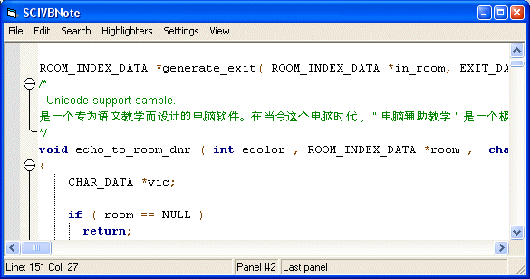



## Scintilla VB ActiveX Control \- Update \(1\.2\)

### Description

Update 4 September 06

----

- Added CodePage support as a property. Default is 0 which has no

support for unicode. UTF-8 adds some basic unicode support.

The support is largely based on the font used. The default font used

is courier new which does support a few character sets.

- Find includes multiline or single line find.

- Bug fix to the ucTreeView from QuitriN to support extended languages

- Few minor bug fixes.

----

This is a large update to the Scintilla VB ActiveX control. Using this control gives you fairly easy access to the Scintilla library available at http://www.scintilla.org for providing excellent source code highlighting support, including but not limited to code folding, code tips, autocomplete, highlighting, and more. This release offers enhanced codetip support, a faster routine for marking all, more options built into the options dialog, a lot of new properties, a more stable interface thanks to Paul Caton's newest subclassing code, and much more. Several demo's are available in the demo's folder to demonstrate some of it's built in features.

I'd like to thank the following people: Stu Collier (Wrote the new code tip routines, Paul Caton (Wrote the new subclassing code), Steve McMahon - http://www.vbaccelerator.com (Helped me overcome a few problems), Carls P.V. (Self contained treeview which I used in the options dialog), Tom De Lange (Wrote the Ariel Color Box also used in the options dialog), and Nick Gisburne (Wrote an excellent small tab control which I used in the options dialog).

I'd also like to thank the PSC community as a whole because I got a lot of idea's on here.

Please if you have any comments including negative or positive share them. I'd like to continue developing this and enhancing it and all the feedback I can get will be greatly appreciated. If you find a bug please feel free to post it here or on the forums at my site. Thank you.
 
### More Info
 
If you need the SciLexer.dll or want the precompiled ocx, you can download the control at http://prdownloads.sourceforge.net/scivb/SCIVB.zip?download.

Full source is included in that download but the demo's and the ocx is precompiled and the newest precompiled SciLexer.dll is also available. For Scintilla source visit http://scintilla.sourceforge.net/ScintillaDownload.html.

             |
---                |---
**Submitted On**   |2006-09-04 09:45:52
**By**             |[Stewart](https://github.com/Planet-Source-Code/PSCIndex/blob/master/ByAuthor/stewart.md)
**Level**          |Intermediate
**User Rating**    |5.0 (40 globes from 8 users)
**Compatibility**  |VB 5\.0, VB 6\.0
**Category**       |[Custom Controls/ Forms/  Menus](https://github.com/Planet-Source-Code/PSCIndex/blob/master/ByCategory/custom-controls-forms-menus__1-4.md)
**World**          |[Visual Basic](https://github.com/Planet-Source-Code/PSCIndex/blob/master/ByWorld/visual-basic.md)
**Archive File**   |[Scintilla\_201775942006\.zip](https://github.com/Planet-Source-Code/stewart-scintilla-vb-activex-control-update-1-2__1-63712/archive/master.zip)

